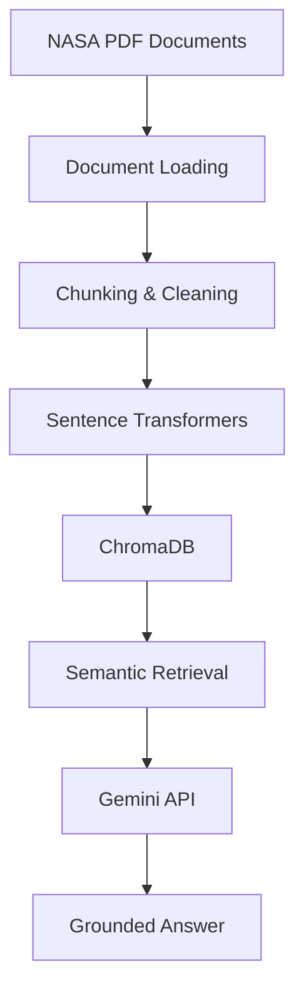
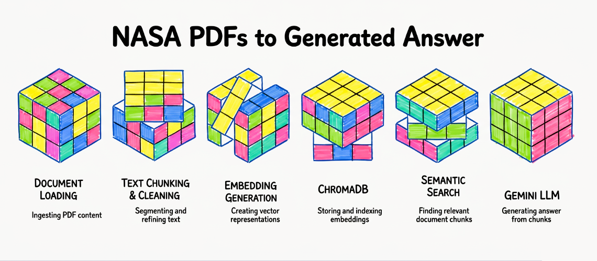
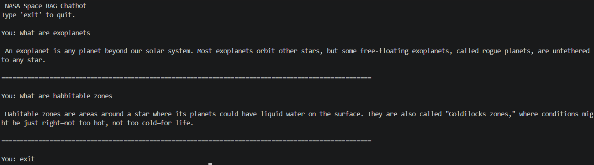

# NASA Exoplanet 

> A Retrieval-Augmented Generation (RAG) chatbot that retrieves relevant NASA document chunks before generating grounded responses using Google's Gemini API.

Built using LangChain, ChromaDB, Sentence Transformers, and Google's Gemini API.

---

##  Project Overview

NASA-EXOPLANET-RAG is a local Retrieval-Augmented Generation (RAG) application built to provide accurate, document-grounded answers to questions related to exoplanets and astronomy.

Instead of relying solely on an LLM's internal knowledge, the chatbot first retrieves the most relevant information from a curated NASA document collection before generating a response. This approach significantly reduces hallucinations while improving factual accuracy.

---

##  Features

-  Automatic PDF document loading
-  Intelligent document chunking
-  Text preprocessing and cleaning
-  Semantic embeddings using Sentence Transformers
-  ChromaDB vector database
-  Top-K semantic retrieval
-  Grounded answer generation using Gemini API
-  Reduced hallucinations through Retrieval-Augmented Generation
-  Fully local retrieval pipeline

---

##  RAG Pipeline



---

## Tech Stack

- Python 3.11
- Google Gemini API
- LangChain
- ChromaDB
- Sentence Transformers (all-MiniLM-L6-v2)
- PyPDFDirectoryLoader
- RecursiveCharacterTextSplitter
- python-dotenv

---

## Installation

### Clone Repository

```bash
git clone https://github.com/bhaktictak/NASA-Exoplanet-RAG.git

cd NASA-Exoplanet-RAG
```

### Install dependencies

```bash
pip install -r requirements.txt
```

### Create a `.env` file

```env
GEMINI_API_KEY=YOUR_API_KEY
```

---

## How to Run

### 1. Load and preprocess documents

```bash
python src/create_vector_db.py
```

This performs:

- Document Loading
- Chunking
- Cleaning
- Embedding Generation
- ChromaDB Creation

---

### 2. Start the chatbot

```bash
python src/rag_chatbot.py
```

---

## Example Questions

- What is an exoplanet?
- What is the Habitable Zone?
- How do scientists detect exoplanets?
- What are rogue planets?
- How many science instruments does JWST have?

---

## Project Demo

### RAG Pipeline



---

### Chatbot



---

## Future Improvements

- Streamlit web interface
- Hybrid Retrieval (Keyword + Semantic Search)
- Multiple embedding model comparison
- Retrieval evaluation metrics
- Metadata-aware filtering
- Conversation memory
- Support for additional NASA datasets
- Docker deployment

---

## Key Concepts Used

- Retrieval-Augmented Generation (RAG)
- Semantic Search
- Vector Embeddings
- Large Language Models (LLMs)
- Prompt Engineering
- Document Chunking
- Vector Databases

---

## Learning Outcomes

This project helped me understand:

- Retrieval-Augmented Generation
- Semantic Search
- Embedding Models
- Vector Databases
- Prompt Engineering
- Document Preprocessing
- LLM Integration

---

##  License

This project is intended for educational and research purposes.

NASA documents remain the property of NASA.

---

## Author

**Bhakti Chand Tak**

GitHub:
https://github.com/bhaktictak